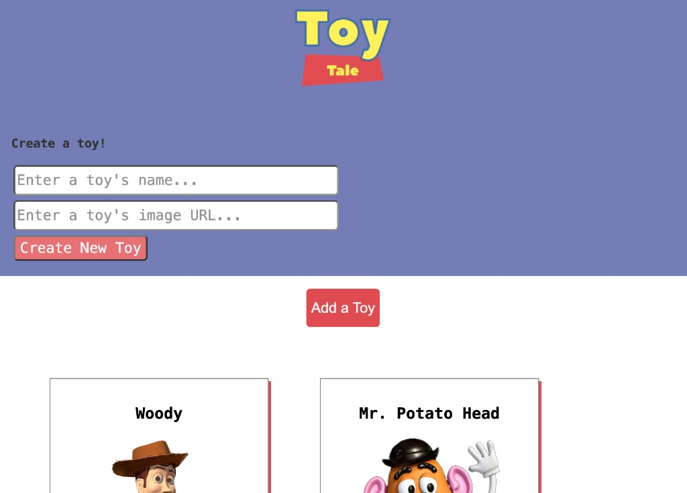

# Toy Tales

Toy Tales is a React toy collection app. Users can view Andy's toys, add a new toy, like a toy, and donate a toy. The React front end talks to a `json-server` API for full CRUD: GET, POST, PATCH, and DELETE.

## Screenshot



## Features

- **See all toys** on page load (`GET /toys`)
- **Create a toy** from the form (`POST /toys`), with likes starting at `0`
- **Like a toy** (`PATCH /toys/:id`) and keep the list order the same
- **Donate a toy** (`DELETE /toys/:id`) and remove it from the page

## Getting Started

1. Install dependencies:

```bash
npm install
```

2. Start the backend (json-server on port 3001):

```bash
npm run server
```

3. In a second terminal, start the React app:

```bash
npm run dev
```

4. Open the app in the browser at `http://localhost:5173` (Vite default) and confirm toys load from `http://localhost:3001/toys`.

5. Run the test suite:

```bash
npm run test
```

## How the data flows

- `App` owns the `toys` array and fetches it once with `useEffect`.
- `ToyForm` is a controlled form. After a successful POST, it sends the new toy up to `App`.
- `ToyContainer` maps toys into `ToyCard` components.
- `ToyCard` handles like (PATCH) and donate (DELETE), then asks `App` to update state.

Toy data lives in `db.json`.
